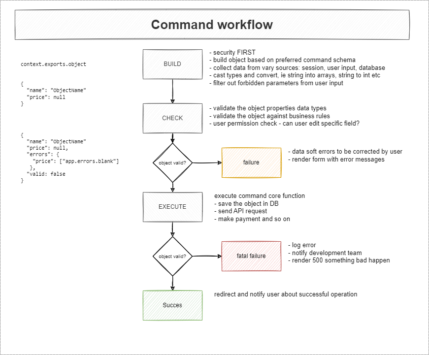

# platformOS Core Module

The goal of this module is to extend the platformOS module system's possibilities.

## Features

- **Hook system** to apply **SOLID's Open/Closed Principle**, allowing you to modify the business logic of other modules in the application folder without changing the source code of existing modules. Use the **Headscripts Hook** to register and aggregate head scripts (CSS, JS, metadata) from other modules and themes, ensuring a cohesive layout and style across your application.

- **Command Generators**: Generate commands using the provided generators, streamlining your development process with structured code scaffolding.

- **Event System**: Use events to record actions and trigger follow-up actions within your application, facilitating clean code separation and asynchronous processing.

- **Global Variable Storage** to set and retrieve variables in the global scope, providing a consistent way to manage data across your application.

- **Module Registry & Dependency Management**: Register your theme with the **module registry** using `hook_module_info`. This info file allows you to define your theme's name, version, type (theme), and dependencies. The module registry handles **dependency management** and **outdated versions**.

- **Module Helper Functions** to verify if a module or theme exists in the system. This feature allows other modules to use installed ones without complex dependencies.

- **Email sending**: The core module provides both a command and a GraphQL mutation for sending emails, making it easy to add email functionality to your application.

- **Validators**: Built-in validators check required fields, data types, and uniqueness, returning detailed error information if validation fails.

## Installation

The platformOS Core Module is available on the [Partner Portal Modules Marketplace](https://partners.platformos.com/marketplace/pos_modules/126).

### Prerequisites

Before installing the module, ensure that you have [pos-cli](https://github.com/mdyd-dev/pos-cli#overview) installed. This tool is essential for managing and deploying platformOS projects.

The platformOS Core Module is fully compatible with [platformOS Check](https://github.com/Platform-OS/platformos-lsp#platformos-check----a-linter-for-platformos), a linter and language server that supports any IDE with Language Server Protocol (LSP) integration. For Visual Studio Code users, you can enhance your development experience by installing the [VSCode platformOS Check Extension](https://marketplace.visualstudio.com/items?itemName=platformOS.platformos-check-vscode).

### Installation Steps

1. **Navigate to your project directory** where you want to install the Core Module.

2. **Run the installation command**:

```bash
   pos-cli modules install core
```
This command installs the Core Module and updates or creates the `app/pos-modules.json` file in your project directory to track module configurations.

### Pulling the Source Code

To use advanced features such as autocomplete for `function`, `include`, and `graphql` tags, you'll need to include the module's source code in your project. Follow these steps:

1. **Pull the Source Code**: Use the `pos-cli` command to pull the source code into your local environment:

```
pos-cli modules pull core
```

2. **Update Your .gitignore**: Add `modules/core` to your `.gitignore` file to avoid directly modifying the module files. This precaution helps maintain the integrity of the module and simplifies future updates.

#### Managing Module Files

The default behavior of modules is that **the files are never deleted**. It is assumed that developers might not have access to all of the files, and thanks to this feature, they can still overwrite some of the module's files without breaking them. Since the Core Module is fully public, it is recommended to delete files on deployment. To do this, ensure your `app/config.yml` includes the Core Module in the list `modules_that_allow_delete_on_deploy`:

``` yaml
modules_that_allow_delete_on_deploy:
- core
```

## Commands / Business Logic

We recommend using **commands** to encapsulate business rules. By following our recommendation, you will improve the consistency of your code, so it will be easy to onboard new developers to the project and easier to take over existing projects. The advantage of this architecture is that **commands are reusable**; they can be executed both during live web requests and as background jobs.

### Commands Directory

We recommend placing your commands in the `lib/commands` directory.

### Naming Conventions

We use a `<resource>/<action>` format for naming conventions. For instance, use `users/create.liquid` or `order/cancel.liquid` to name your command files.

### Execution

Commands are designed for easy execution as background jobs — ideal for heavy tasks like external API calls, expensive operations computations, or generating reports. Each command might produce an [Event](#events).

### Generating Commands

Use the generator provided by the core module to quickly set up the recommended structure with initial code:

```bash
pos-cli generate run modules/core/generators/command <command>
```

**Example:**

```bash
pos-cli generate run modules/core/generators/command dummy/create
```

To scaffold a complete CRUD operation at once, use:

```bash
pos-cli generate run modules/core/generators/crud <dummy> title:string uuid:string c__score:integer --include-views
```

### Command Workflow

Commands in platformOS follow a structured three-stage process. We recommend organizing each stage into separate files:



Here is a typical setup for a dummy command located at `app/lib/commands/dummy/create.liquid`:

```liquid

```

### Build Stage

In the build stage, you **prepare the command's input**. This step involves processing user input, typically submitted through a form (`context.params`). Here, you normalize the data, perform necessary type conversions before it is stored or used further in your application.

By defining a build command, you can manipulate incoming data, perform validations, ensure that only permissible data is processed, and the data meets your application's requirements. This is especially useful for tasks like cleaning up user input, setting default values, and enforcing data consistency.

The build command is implemented using Liquid templates, which manipulate and format the incoming data into a structured JSON object. This process ensures that your data is well-structured and ready for the next steps.

Here’s how a typical build command might look in `app/lib/commands/dummy/build.liquid`:

```liquid

  {
    "title": {{ object.title | downcase | json }},
    "uuid": {{ object.uuid | json }},
    "c__score": 0
  }



```

This example build command sets up initial data, generates a UUID if not provided in params, and initializes the `c__score` (cache score) to zero. It also converts the title to lowercase.

### Check Stage

In the check stage, you **validate the inputs** to ensure they meet the required criteria, such as field presence, uniqueness, and proper formatting.

The results from this stage are always returned in a hash with two keys: `valid`, which can be either `true` or `false`, and if `false`, an `errors` key that provides details on why the validation failed.

The core module comes equipped with several [built-in validators](#validators) to streamline these validations.

Here’s an example of what a check operation might look like in `app/lib/commands/dummy/check.liquid`:

```liquid
{% liquid
  assign c = '{ "errors": {}, "valid": true }' | parse_json

  function c = 'modules/core/validations/presence', c: c, object: object, field_name: 'title'
  function c = 'modules/core/validations/presence', c: c, object: object, field_name: 'uuid'
  if object.title
    function c = 'modules/core/validations/presence', c: c, object: object, field_name: 'title'
    function c = 'modules/core/validations/length', c: c, object: object, field_name: 'title', minimum: 3
    function c = 'modules/core/validations/length', c: c, object: object, field_name: 'title', maximum: 130
  endif

  function c = 'modules/core/validations/uniqueness', c: c, object: object, field_name: 'uuid'

  assign object = object | hash_merge: c

  return object
%}

```

This script ensures that the title and UUID fields are present and checks the title for minimum and maximum length requirements. It also ensures the uniqueness of the UUID, essential for maintaining data integrity across your application.

### Execute Stage

Once the inputs pass validation in the check stage, the process moves to execution, typically involving a single [platformOS GraphQL Mutation](https://documentation.platformos.com/get-started/build-your-first-app/saving-data-to-the-database#save-the-data-in-the-database). Any errors occurring at this stage should be considered as 500 server errors. Allowing errors in this phase suggests issues with code organization, as all necessary validations to prevent these errors should have been completed in the `check` stage.

Here’s an example from `app/lib/commands/dummy/execute.liquid` showing how a command is executed:

```liquid

```

In this script, the GraphQL mutation `dummy/create` is called with the validated object as its argument. If successful, it updates the object's state to valid and returns it.

**Note**: Execution typically involves invoking a GraphQL mutation. If this aligns with your requirements, you can use a generic execution function from the core module found at [`modules/core/public/lib/commands/execute.liquid`](https://github.com/Platform-OS/pos-module-core/blob/master/modules/core/public/lib/commands/execute.liquid). This function standardizes how mutations are handled, improving code reusability and maintainability.

Here is how you can invoke a GraphQL mutation defined in `app/graphql/dummy/create.graphql` using the core module's execution function:

```liquid

```

## Hooks

Hooks allow you and other developers to extend the functionality of your modules or applications without altering the existing code, but by writing a new one. It follows the Open/Close Principle. You achieve it by creating an entry point in a specific point in your application flow, which dynamically executes additional code implemented by matching hooks. 

Hooks are defined via [Liquid partials](https://documentation.platformos.com/developer-guide/glossary#partial) that start with `hook_` prefix. We recommend placing them in `lib/hooks` directory. These partials (hooks) are executed via the core module's `modules/core/commands/hooks/fire` function described below.

Organize your hooks into appropriate folders to maintain a clean project structure:

- **Application Hooks**: Located in `app/lib/hooks/`, e.g., `hook_permission.liquid`
- **Module Hooks**: Located in `modules/your-module/public/lib/hooks/`, e.g., `hook_permission.liquid`

### Implementing Hooks

Implementing a hook means providing the specific logic that should execute when the hook is fired. This is where you define what actually happens when a hook is triggered.

1. **Create Hook Implementation**: For the hook declared as `hook_my-hook.liquid`, create an implementation file in an appropriate directory, such as `app/lib/hooks/hook_my-hook.liquid`. In other words, create a Liquid file named after the hook, such as `hook_HOOKNAME.liquid`.

2. **Add Logic to the Hook**: In your hook implementation file, add the logic that should execute. This could include logging, data manipulation, or any other functionality.

3. **Returning from Hooks**: All hooks are invoked via [function](https://documentation.platformos.com/api-reference/liquid/platformos-tags#function), which means that every hook must use [return](https://documentation.platformos.com/api-reference/liquid/platformos-tags#return) tag, even if it is `return null`.

**Note:** To execute the hook, fire it via `modules/core/commands/hook/fire` function and provide your hook name as an argument - `my-hook`; combination of a naming convention (`hook_` prefix) and using the core module's function turns the Liquid partial into a hook. 

### Declaring and Configuring Hooks

To make a hook available for implementation by others, you need to declare and configure it within your project. This setup allows others to extend and customize your code without altering the core functionality.

To make a hook operational and integrate it into your application’s logic, you must explicitly call it using the `modules/core/commands/hook/fire` function. This involves specifying the hook's name (without `hook_` prefix).

For example, if you have declared a hook named `my-hook` (for example by creating a file `app/lib/hooks/hook_my-hook.liquid`), you fire it as follows:

```liquid

```

When you fire a hook using the `modules/core/commands/hook/fire` command, the system dynamically searches for all Liquid files that match the pattern `hook_<hook_name>`. If you fire `my-hook`, the system looks for partials whose path ends with `/hook_my-hook`.

Find the [fire.liquid implementation here](https://github.com/Platform-OS/pos-module-core/blob/master/modules/core/public/lib/commands/hook/fire.liquid).

**Parameters and Result Merging**: When firing a hook, you can pass data using the `params` attribute, which will be forwarded to all implementations of the hook. The `merge_to_object` attribute can be used to combine results from different hook implementations into a single object.

### Example for Demonstrating Purpose

To illustrate the dynamic nature of hooks, consider the following example. If you have code like this anywhere in your project, let's say in `app/views/pages/test-hook.liquid`:

```liquid

```

And then you create a file `app/lib/hooks/hook_add-code-dynamically.liquid` with content:

```liquid


```

When you invoke `https://example.com/test-hook` and check the logs using `pos-cli logs <env>`, you should see:

```
[2024-07-15 14:48:24.413Z] - info: Hello
path: /test-hook page: test-hook
[2024-07-15 14:48:24.434Z] - info: I'm here
path: /test-hook page: test-hook partial: hooks/hook_add-code-dynamically
[2024-07-15 14:48:24.434Z] - info: Bye
```

This demonstrates how the hook system dynamically integrates additional logic at runtime without altering the original code structure.

### Additional Hook Options

- Define [**alter hooks**](https://github.com/Platform-OS/pos-module-core/blob/master/modules/core/public/lib/commands/hook/alter.liquid) to modify data before it is processed further, such as before saving to the database or rendering to the user.

- **Parameters**: Pass additional data to hooks using the `params` attribute. Params will be sent to all hook implementations.
  
- **Result Merging**: Use the `merge_to_object` attribute to combine results from various hooks into a single object or collect them in an array.

### Examples of Hook Implementations

#### Returning Arrays with Hooks

Consider the example of the [Permission Module](https://github.com/Platform-OS/pos-module-permission), which doesn't require parameters for its `get_permissions` function:

```

```

This function retrieves all available permissions in your application.

The Permission Module implements its hook with permission-related permissions, so in `modules/permission/public/lib/hooks/hook_permission.liquid` you can find this:

```

```

Similarly, the [User Module](https://github.com/Platform-OS/pos-module-user) includes user-related permissions:

```

```

You can create your own permissions by creating a `hook_permission.liquid` file, either in `app/views/partials/hooks/` or within a custom module directory:

```

```

When the `permission` hook is fired, it aggregates and returns the following array of permissions from all implementations:

```
["permissions.manage","user.create", "user.delete", "user.update","custom_permission","another_custom_perm"]
```

#### Passing Parameters to Hooks

For example, in the [User Module](https://github.com/Platform-OS/pos-module-user), we created a hook called `user_create`. Here’s how it is set up:

```liquid
assign params = '{}' | parse_json | hash_merge: created_user: user.user, hook_params: hook_params
function results = 'modules/core/commands/hook/fire', hook: 'user_create', params: params, merge_to_object: true
hash_assign user['hook_results'] = results
```

This configuration enables you to execute additional actions when a user is created. You need to create a file (or files) named `hook_user_create.liquid` in the appropriate directory (either within your app or a specific module). This file should contain the custom logic you wish to apply.

For example, you can **store additional values in your custom profile structure** and use the created user's ID as a reference.

Here’s how you could structure your `app/lib/hooks/hook_user_create.liquid` to achieve this:

```liquid

  {
    "user_id": {{ params.created_user.id | json }},
    "first_name": {{ params.hook_params.first_name | json }},
    "last_name": {{ params.hook_params.last_name | json }},
    "dog_name": {{ params.hook_params.dog_name | json }},
    "favorite_color": {{ params.hook_params.favorite_color | json }}
  }


```

This script processes additional parameters provided during user creation and updates the user's profile in the database.

Another practical use could be to **subscribe the newly created user to a newsletter** via an API of a third-party service. In this scenario, your `hook_user_create.liquid` file would look like this:

```liquid

  
    {
      "email": {{ params.created_user.email | json }}
    }
  
  
    mutation ($data: HashObject!)  {
      api_call: api_call_send(
        data: $data
        template: { name: "nl_subscribe" }
      ) {
        response{ status body }
        errors {
          message
        }
      }
    }
  



```

And here's how you can define the API call in `app/api_calls/nl_subscribe.liquid`:

```liquid
---
request_type: "POST"
to: "https://your-api-call.com"
request_headers: '{
  "Content-Type": "application/json"
}'
---
{{ data | json }}

```

This configuration sends a POST request to the specified URL with the user’s email as JSON data, subscribing them to the newsletter.

## Events

**Events**allow you to record that something has happened in the system. Think of them as logs that capture these actions. When an event occurs, other parts of the application might need to react to it. In platformOS, these events are stored using GraphQL mutations and can include various arguments detailing what happened. They enable you to add logic to existing commands and are executed asynchronously in the background.

### Practical Uses of Events

- **Form Submissions**: When a user submits a contact form, an event can log this action and trigger follow-up actions such as sending a confirmation email or updating a CRM system.
- **Data Processing Completion**: Once a background job processes data, an event can signal completion, notifying other systems or updating the user interface to reflect the new data.
- **Real-Time Updates**: Events can send real-time notifications to users, such as alerts for new messages, status updates, or system alerts.

### Example Scenario

Imagine you have an e-commerce platform where users can place orders. When an order is placed, several things need to happen:
1. The order needs to be saved in the database.
2. An email confirmation needs to be sent to the user.
3. The inventory needs to be updated.
4. The sales team needs to be notified.

By creating an event when the order is placed, each of these actions can be handled separately by different parts of the application, ensuring a clean and manageable codebase.

Here's how you can record an event in platformOS:

```liquid

```

This function logs an event of the type `order_placed`, which can then trigger other actions within the system. It's important to note that this method does not use the typical `record_create` but rather `activity_create` to log the event as an activity.

For more detailed information on how activities are handled in platformOS, please refer to the [Activity Feeds documentation](https://documentation.platformos.com/developer-guide/activity-feeds/activity-feeds).

### Defining the event

An event in platformOS has a type and structure. The event type must be unique and is not scoped. To define an event, create a file in `app/lib/events/your_event_name`. The event type should reflect an action that occurred in the past. The metadata section defines the structure of the data passed to the event, and you must validate that certain parameters are passed.

`app/lib/events/something_happened`

```
---
metadata:
  event:
    foo_id
---

```

### Publishing the Event

Once something happened in the application, you can publish the event. Events should be published directly from a page or a command.

`app/views/pages/debug.liquid`

```

```

Upon publishing, the event is validated and stored in activities. However, to act upon this event, you need to write a consumer.

The `publish` command returns a [BackgroundJob ID](https://documentation.platformos.com/best-practices/backend-performance/background-jobs). You can view scheduled and running background jobs via `pos-cli gui serve -> Background Jobs`. Background jobs created through the `publish` command follow the naming convention `modules/core/commands/events/create:<type>`.

**Note:** Successfully processed jobs are deleted and are not visible in the UI anymore.

### Handling Events

To execute code when a specific event occurs, you need to create a consumer. Multiple consumers can be associated with a single event. To create a consumer, follow these steps:

1. Create a file in the `app/lib/consumers/<name_of_the_event>/<name_of_your_file>` directory.

2. Define configuration options in the consumer file. Here are some options you can set:
   - **priority**: (String, default: `default`) Defines the consumer's priority. Possible values: `low`, `default`, `high`.
   - **max_attempts**: (Int, default: `9`) If the consumer fails, platformOS will automatically retry it up to the specified number of attempts. This is useful for handling transient errors, such as network issues. To prevent any retries, set `max_attempts` to `0`.
   - **delay**: (Float, default: `0`) Sets a delay (in minutes) before triggering the consumer. For delays less than a minute, use fractions (e.g., `0.5` for 30 seconds).

Example consumer file: `app/lib/consumers/something_happened/do_something.liquid`

```liquid
---
metadata:
  priority: default
  max_attempts: 9
  delay: 0
---

```

For this example, the event object will look like:

```json
{
  "id": "ActivityStreams::Activity.1382917",
  "uuid": "22ed7654-9521-42dd-b5f0-02e79c03f749",
  "foo_id": "12345",
  "type": "something_happened",
  "date": "2023-03-17T10:42:41.957Z"
  "bar": "extra info"
}
```

Events can be published and consumed by different parts of the application. You can write a consumer that reacts to events published by a module or other parts of your system.

### Debugging Events

The core module provides a simple UI to help you preview published events, re-trigger them, and more. This UI is available only in the staging environment at `/_events`.


## Status handling

You can create a new status with a command so you will have a status history in your entity. When you create a status, the `status_created` event will be published with the status object, so you can create your consumer and set your entity's status cache (for example `c__status`) field.

### Creating a status

```liquid

```

You can also set `timestamp` and `payload` if you need.

### Deleting a status

```liquid

```

### Loading a status

```liquid

```

### Searching for statuses

```liquid

```

### Deleting a status

```liquid

```

## Variable storage

You can set a variable with

```
function res = 'modules/core/commands/variable/set', name: 'VARIABLE_NAME', value: 'VARIABLE_VALUE'
```

This function will return the created variable's value.

And you can get a variable value with

```
function variable_va = 'modules/core/queries/variable/find', name: 'VARIABLE_NAME', default: 'DEFAULT_VALUE'
```

You can pass the `type` argument that can be an array, integer, float, boolean, or object.

## Session storage

You can store small data in a session. A session is connected with the current browser session.

```liquid
  assign data = null | hash_merge: bar: 'some value'

  function _ = 'modules/core/commands/session/set, key: 'foo', value: data
  function data = 'modules/core/commands/session/get', key: 'foo'
  function _ = 'modules/core/commands/session/clear', key: 'foo'
```

## Module registry

You can register your module or theme by implementing `hook_module_info` under `lib/hook/`. An info file should look like this:

```

{
  "name": "pOS Admin",
  "machine_name": "admin",
  "type": "module",
  "version": "1.0.0",
  "dependencies": [
    "core"
  ]
}



```

It is possible to list the registered modules and themes with

```
function modules = 'modules/core/queries/registry/search, type: 'module`
function themes = 'modules/core/queries/registry/search, type: 'theme`
function all = 'modules/core/queries/registry/search
```

## Email sending

The core module provides a command for email sending that you can call in your app or other modules:

```

  {
    "to":      "grievous@example.com",
    "from":    "kenobi@example.com",
    "cc": [],
    "bcc": [],
    "subject": "Hello there!",
    "layout": "path/to/my_layout",
    "partial": "path/to/email_partial",
    "data": { "user": " { "first_name:" "John" } }
  }


```

The code above will send an email from `kenobi@example.com` to `grievous@example.com` with the subject of `Hello there!` using your liquid partial defined in `app/views/partials/path/to/email_partial.liquid` with the layout file defined in `app/views/layouts/path/to/my_layout.liquid`.

You can pass any additional data as part of the `object` and it'll be available in your `app/views/partials/path/to/email_partial.liquid` partial as `data`:

```liquid
<h1>Hello {{ data.user.first_name }}!</h1>
```

Note: By default platformOS does not send real emails from staging environment - please ensure to [Configure test email on your instance](https://documentation.platformos.com/developer-guide/partner-portal/instances/configuring-test-email) to be able to send emails from staging environment.

## Headscripts hook

The core module provides a hook for other modules to register their head scripts (CSS, JS, metadata, etc).
The modules can implement a `hook_headscripts.liquid` file that returns standard HTML, then you can render the aggregated head scripts in your layout using the `headscripts/search` query:
```
<!DOCTYPE html>
<html lang="en">
  <head>
    
    {{ headscripts }}
  </head>
```

The [Theme manager](https://github.com/Platform-OS/pos-module-theme-manager) module uses the same hook to add theme-specific head scripts from the active theme.

## Helpers

You can check if a module or theme is installed on the project:

```
function exists = 'modules/core/queries/module/exists', type: 'module'
```

## Validators

The core module provides some basic helpers for data validation.

These validators can check if all required fields are provided, check uniqueness, data types (numbers are really numbers and not letters), etc. Validators always return a hash with two keys - valid being either true or false, and if false - errors with details of why the validation has failed.

You can find the core validators at [modules/core/public/lib/validations](https://github.com/Platform-OS/pos-module-core/tree/master/modules/core/public/lib/validations).

## Generators

Core module provides useful generators to quickly create files.

- command


## Contribution

Please check `.github/CONTRIBUTING.md`
